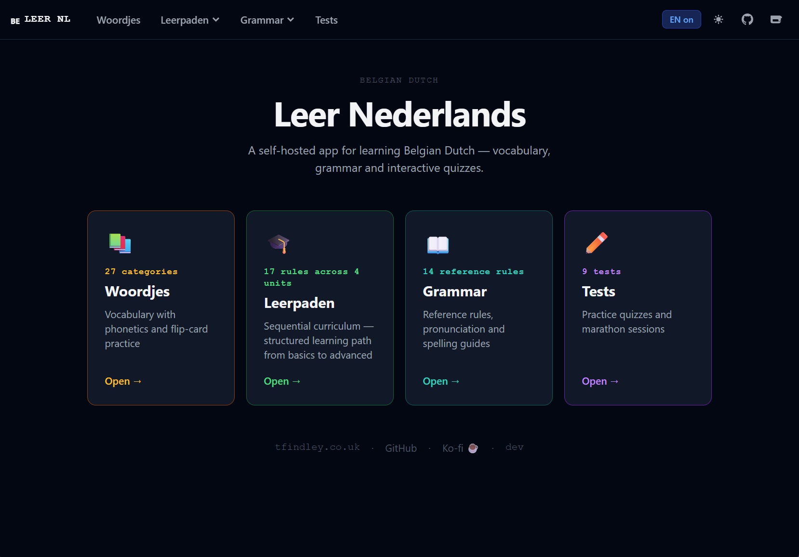

# Learn Dutch (Belgian)

[](https://github.com/tfindley/learn-dutch/actions/workflows/build.yml)

A self-hosted Belgian Dutch learning app — three interactive modules served as a static site from an nginx container.




## Disclaimer

This tool was written collaboratively with AI: Claude Code - Claude Opus 4.7. [CLAUDE.md](CLAUDE.md) is included for reference.

## Navigation

```text
🇧🇪 LEER NL
├── Woordjes                    /woordjes
│   └── [category]              /woordjes/:categoryId
├── Leerpaden                   /leerpaden
│   ├── Leerpad 1               /leerpaden/1
│   │   ├── 1A — rules          /leerpaden/1/:ruleId
│   │   └── 1B — rules          /leerpaden/1/:ruleId
│   ├── Leerpad 2               /leerpaden/2
│   │   ├── 2A — rules
│   │   └── 2B — rules
│   ├── Leerpad 3               /leerpaden/3
│   │   ├── 3A – 3C — rules
│   └── Leerpad 4               /leerpaden/4
│       ├── 4A – 4C — rules
├── Grammar                     /grammar
│   ├── Reference               /grammar/reference
│   │   └── [rule]              /grammar/reference/:ruleId
│   └── Uitspraak               /grammar/uitspraak
│       └── [rule]              /grammar/uitspraak/:ruleId
├── Tests                       /tests
│   └── [test / marathon]       /tests/:testId → /tests/:testId/results
└── Changelog                   /changelog
```

All content is focused on **Belgian Dutch** — pronunciation, vocabulary, and usage specific to Belgium rather than the Netherlands.

## Running locally

**With Node (dev server):**

```bash
npm install
npm run dev       # http://localhost:5173
```

**With Docker:**

```bash
docker build -t learn-dutch .
docker run --rm -p 8080:80 learn-dutch
# open http://localhost:8080
```

**With Docker Compose:**

```bash
# Build from source
docker compose -f docker-compose.build.yml up --build

# Pull from registry
docker compose up
```

## Configuration

| Variable | Where | Purpose |
| --- | --- | --- |
| `VITE_GA_ID` | Build arg / CI secret | Google Analytics 4 Measurement ID — omit to disable analytics |
| `CA_CERT_URL` | Build arg / CI secret | PEM CA bundle URL for npm traffic behind an internal proxy |

## Contributing

Content lives in individual JSON files under `src/content/` — adding a new file is automatically picked up at build time:

| Content | Directory | One file per… |
| --- | --- | --- |
| Vocabulary | `src/content/woordjes/` | category (e.g. `greetings.json`) |
| Leerpad sections | `src/content/leerpaden/` | section (e.g. `1a.json`, `2b.json`) |
| Grammar rules | `src/content/grammar/` | rule (e.g. `articles.json`) |
| Uitspraak rules | `src/content/uitspraak/` | rule (e.g. `pron_vowels.json`) |
| Tests | `src/content/tests/` | test (e.g. `test_opening.json`) |

Files prefixed with `_` (e.g. `_groups.json`, `_tips.json`) are index/metadata files, not individual content items.

The page components in `src/pages/` and shared components in `src/components/` rarely need changing unless you're modifying the UI.

## Support

If you find this useful, consider buying me a coffee:

[](https://ko-fi.com/tfindley)

---

Made by [tfindley.co.uk](https://tfindley.co.uk)
